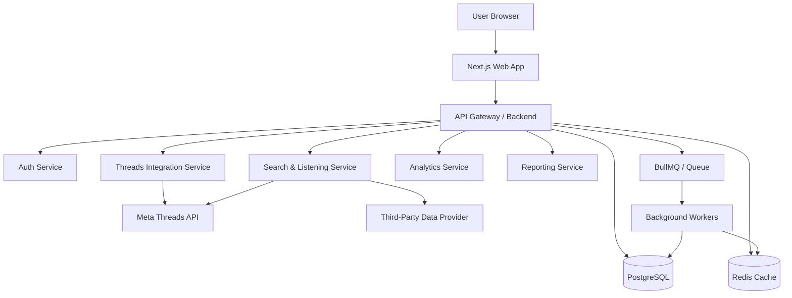

# Product Requirement Document (PRD)

## Project: Threads Monitoring & Analytics Web App (TMA)

**Version:** 1.1.0  
**Status:** Approved for Production Planning  
**Prepared for:** Product, Engineering, Data, and Business Teams  
**Author:** AI Product Consultant  
**Date:** Mei 2026  
**Document Type:** Production-ready PRD

---

## 1. Executive Summary

### 1.1 Objective

Threads Monitoring & Analytics Web App (TMA) adalah aplikasi web berbasis dashboard untuk membantu brand, agency, social media manager, dan creator dalam melakukan:

1. **Owned-media analytics** untuk akun Threads yang mereka hubungkan sendiri.
2. **Competitor monitoring** untuk membaca performa akun publik kompetitor.
3. **Keyword dan hashtag monitoring** untuk social listening di Threads.
4. **Reporting dan insight generation** untuk membantu pengambilan keputusan konten, kampanye, dan reputasi digital.

Aplikasi ini dirancang sebagai platform full-stack yang aman, scalable, dan production-ready, dengan pendekatan **official API first** melalui Meta Threads API, lalu dilengkapi **third-party data provider** hanya jika dibutuhkan untuk cakupan data, enrichment, atau fallback operasional.

### 1.2 Business Goals

- Menyediakan dashboard monitoring Threads yang dapat digunakan oleh brand dan agency untuk kebutuhan reporting rutin.
- Mengurangi proses manual dalam mencari post, keyword, hashtag, dan performa kompetitor.
- Memberikan insight yang actionable untuk strategi konten, kampanye, dan reputasi.
- Membangun fondasi produk yang dapat dikembangkan menjadi social listening multi-platform.

### 1.3 Success Metrics

| Area | Success Metric |
|---|---|
| Product Adoption | ≥ 80% user aktif berhasil connect akun Threads dalam onboarding pertama |
| Data Reliability | ≥ 95% request data berhasil diproses tanpa error kritikal |
| Dashboard Usage | ≥ 60% user aktif membuka dashboard minimal 3x per minggu |
| Reporting Efficiency | Waktu pembuatan report Threads turun minimal 50% dibanding proses manual |
| Performance | Dashboard utama load ≤ 3 detik untuk data cached |
| System Stability | Uptime aplikasi ≥ 99.5% per bulan |

---

## 2. Target Users & Personas

### 2.1 Primary Users

#### 1. Social Media Manager
Membutuhkan dashboard untuk melihat performa konten Threads, memahami engagement, dan menentukan konten mana yang perlu diperkuat.

#### 2. Digital Strategist / Analyst
Membutuhkan data kompetitor, tren keyword, analisis sentimen, dan insight untuk laporan mingguan atau bulanan.

#### 3. Brand / Agency Team
Membutuhkan monitoring brand, competitor benchmark, dan rangkuman isu untuk mendukung rekomendasi kampanye.

#### 4. Creator / Publisher
Membutuhkan ringkasan performa konten personal untuk mengoptimalkan posting, format konten, dan waktu publikasi.

### 2.2 Key User Needs

- Melihat performa akun sendiri secara cepat.
- Memantau username kompetitor.
- Melacak keyword, hashtag, dan isu tertentu.
- Menyimpan keyword monitoring secara berulang.
- Mengekspor data atau insight untuk kebutuhan reporting.
- Memastikan data dikumpulkan secara legal, aman, dan sesuai batasan API.

---

## 3. Product Scope

### 3.1 In Scope

- Login dan user management internal.
- Connect akun Threads menggunakan Meta OAuth.
- Owned-media dashboard untuk akun Threads yang terhubung.
- Competitor public profile monitoring.
- Keyword dan hashtag monitoring.
- Dashboard tren engagement dan volume percakapan.
- Data caching, queue, background worker, dan audit log.
- Export report ke CSV/XLSX/PDF pada fase lanjutan.
- Role-based access control untuk kebutuhan team/agency.

### 3.2 Out of Scope untuk MVP

- Auto-publishing konten Threads.
- Auto-reply atau moderation.
- AI content generator.
- Multi-platform listening selain Threads.
- Full CRM atau campaign management.
- Data scraping langsung tanpa provider yang jelas legalitas dan compliance-nya.

### 3.3 Key Product Principle

Produk harus mengutamakan **data reliability, compliance, dan interpretability**. Jika data tidak tersedia karena batasan API, rate limit, permission, private account, atau provider issue, sistem wajib menampilkan status secara eksplisit dan tidak menampilkan angka estimasi yang tidak jelas sumbernya.

---

## 4. Platform & API Assumptions

### 4.1 Official API First

TMA harus mengutamakan integrasi resmi Meta Threads API untuk fitur yang sudah didukung, terutama:

- Authentication dan account connection.
- Retrieval profil akun sendiri.
- Retrieval media/post akun sendiri.
- Insights akun dan media milik user.
- Keyword search jika tersedia untuk app/access level yang digunakan.
- Publishing atau reply management hanya jika masuk scope fase lanjutan.

### 4.2 Third-Party Provider as Fallback / Enrichment

Third-party provider seperti Apify, EnsembleData, Data365, atau provider sejenis hanya digunakan untuk:

- Coverage data publik yang tidak tersedia melalui access level official API.
- Enrichment data kompetitor atau keyword ketika official API tidak mencukupi.
- Historical backfill jika official API tidak menyediakan data historis sesuai kebutuhan.
- Backup operational ketika API resmi mengalami limit atau coverage gap.

Setiap provider wajib melalui evaluasi:

- Legal basis dan Terms of Service.
- Reliability dan SLA.
- Data freshness.
- Field completeness.
- Rate limit dan biaya.
- Data privacy dan storage policy.

### 4.3 Data Availability Disclaimer

Tidak semua data Threads dapat diakses secara penuh. Sistem wajib mengomunikasikan keterbatasan berikut:

- Akun private tidak dapat dimonitor secara publik.
- Data insight detail hanya tersedia untuk akun yang terhubung dan memiliki permission sesuai.
- Keyword search dapat dibatasi oleh access level, rate limit, region, atau policy platform.
- Data dari provider pihak ketiga dapat memiliki latency, sampling, atau coverage gap.

---

## 5. Recommended Production Architecture

### 5.1 High-Level Architecture



### 5.2 Tech Stack Recommendation

| Layer | Recommendation | Notes |
|---|---|---|
| Frontend | Next.js 14+ App Router, TypeScript, TailwindCSS | Production-grade dashboard foundation |
| UI Components | Shadcn UI, Tremor, Recharts / ECharts | Suitable for dashboard and charts |
| Backend | NestJS or Next.js API Routes/Server Actions | NestJS recommended for enterprise scale |
| Database | PostgreSQL | Core relational storage |
| Cache | Redis | API response caching and rate-limit control |
| Queue | BullMQ | Async keyword search, refresh jobs, report generation |
| Auth | Auth.js / NextAuth.js | Internal login/session |
| OAuth | Meta OAuth 2.0 | Threads account connection |
| Storage | S3-compatible object storage | Exported reports and archived files |
| Observability | Sentry, OpenTelemetry, Grafana/Prometheus | Error, trace, and uptime monitoring |
| Deployment | Vercel + managed backend, or AWS/GCP/Render/Fly.io | Depends on scale and infra preference |

### 5.3 Recommended Service Boundaries

1. **Auth Service**  
   Handles internal user login, roles, sessions, and password reset.

2. **Threads Integration Service**  
   Handles Meta OAuth, token exchange, token refresh/expiry handling, profile retrieval, and owned-media metrics.

3. **Search & Listening Service**  
   Handles keyword, hashtag, and public account monitoring through official API or approved provider.

4. **Analytics Service**  
   Handles metric aggregation, ranking, benchmark, sentiment classification, and trend calculation.

5. **Reporting Service**  
   Handles export jobs, scheduled reports, and shareable dashboard snapshots.

---

## 6. Functional Requirements

## Feature 6.1 — Internal Authentication & User Management

### Description
Sistem login internal agar user dapat mengakses dashboard, menyimpan preference, keyword monitoring, dan koneksi akun Threads.

### User Story
Sebagai user, saya ingin login menggunakan email/password atau Google Auth agar data monitoring dan dashboard saya tersimpan dengan aman.

### Acceptance Criteria

- User dapat registrasi menggunakan email dan password.
- User dapat login menggunakan email/password.
- User dapat login menggunakan Google Sign-In.
- User dapat melakukan forgot password.
- Password wajib disimpan dalam bentuk hash menggunakan Argon2id atau bcrypt.
- Session menggunakan secure HTTP-only cookie atau database session.
- Sistem mendukung logout dari semua device.
- Sistem mencatat audit log untuk login, logout, dan password reset.

### Priority
P0 — MVP Critical

---

## Feature 6.2 — Organization & Role-Based Access Control

### Description
Mendukung penggunaan oleh team/agency dengan role berbeda.

### Roles

| Role | Access |
|---|---|
| Owner | Full access, billing, user management |
| Admin | Manage workspace, connect account, manage keyword |
| Analyst | View dashboard, create report, export data |
| Viewer | View-only dashboard |

### Acceptance Criteria

- User dapat membuat workspace.
- Owner/Admin dapat invite member.
- Role menentukan hak akses fitur.
- Viewer tidak dapat connect/disconnect akun.
- Semua perubahan role tercatat di audit log.

### Priority
P1 — Recommended for Beta

---

## Feature 6.3 — Connect Threads Account

### Description
User menghubungkan akun Threads miliknya menggunakan Meta OAuth.

### User Story
Sebagai user, saya ingin menautkan akun Threads melalui Meta Login agar aplikasi dapat membaca profil dan performa konten saya secara legal.

### Acceptance Criteria

- Terdapat tombol **Connect Threads Account**.
- User diarahkan ke halaman otorisasi Meta.
- Sistem meminta permission sesuai kebutuhan fitur, minimal:
  - `threads_basic`
  - permission insights sesuai requirement official API
  - `threads_content_publish` hanya jika fitur publishing masuk scope
- Backend menerima authorization code.
- Backend menukar code menjadi short-lived access token.
- Backend menukar short-lived token menjadi long-lived token jika didukung flow resmi.
- Token disimpan terenkripsi menggunakan AES-256-GCM.
- Sistem menyimpan expiry date token.
- Jika token expired, dashboard menampilkan status **Reconnect Required**.
- User dapat disconnect akun Threads.
- Disconnect menghapus token atau menandai token sebagai revoked.

### Priority
P0 — MVP Critical

---

## Feature 6.4 — Owned-Media Profile Dashboard

### Description
Menampilkan ringkasan profil dan metrik akun Threads user yang sudah terhubung.

### User Story
Sebagai user, saya ingin melihat profil Threads saya dan metrik utama akun agar saya dapat memahami performa akun secara cepat.

### Data Display

- Username
- Display name
- Bio
- Profile picture
- Followers count
- Account ID
- Last synced time
- Connection status

### Acceptance Criteria

- Dashboard menampilkan profil akun yang terhubung.
- Dashboard menampilkan status sync terakhir.
- Jika API gagal, sistem menampilkan pesan error yang jelas.
- Data profil menggunakan cache TTL 15 menit.
- User dapat melakukan manual refresh dengan batas rate limit internal.

### Priority
P0 — MVP Critical

---

## Feature 6.5 — Owned-Media Post Performance

### Description
Menampilkan daftar post Threads milik akun user beserta metrik performa.

### User Story
Sebagai user, saya ingin melihat daftar post terbaru dan performanya agar dapat mengetahui konten mana yang paling efektif.

### Metrics

- Views / impressions jika tersedia
- Likes
- Replies
- Reposts
- Quotes jika tersedia
- Shares jika tersedia
- Engagement total
- Engagement rate
- Published timestamp
- Post type
- Caption/text
- Permalink

### Acceptance Criteria

- User dapat melihat minimal 50 post terbaru.
- User dapat filter post berdasarkan tanggal.
- User dapat sort berdasarkan engagement, likes, replies, reposts, views, dan publish date.
- Sistem menampilkan empty state jika belum ada post.
- Sistem menampilkan unavailable state jika field tertentu tidak tersedia dari API.
- Metrik tidak boleh dimanipulasi atau diestimasi tanpa label yang jelas.

### Priority
P0 — MVP Critical

---

## Feature 6.6 — Competitor Username Monitoring

### Description
User dapat memasukkan username Threads publik untuk memantau post dan performa dasar kompetitor.

### User Story
Sebagai user, saya ingin memantau username kompetitor agar dapat melihat pola konten dan engagement mereka.

### Acceptance Criteria

- Input menerima username dengan atau tanpa `@`.
- Sistem melakukan normalisasi username.
- Sistem memvalidasi apakah akun tersedia dan publik.
- Jika akun private, tampilkan pesan **Account is Private or Not Accessible**.
- Jika akun tidak ditemukan, tampilkan pesan **Account Not Found**.
- Sistem menampilkan daftar post publik kompetitor jika data tersedia.
- Sistem menampilkan tren engagement mingguan jika data historis tersedia.
- User dapat menyimpan username ke watchlist.
- Sistem menyimpan source data: official API atau third-party provider.

### Priority
P1 — Beta Critical

---

## Feature 6.7 — Keyword & Hashtag Monitoring

### Description
User dapat mencari keyword atau hashtag untuk melihat percakapan publik di Threads.

### User Story
Sebagai user, saya ingin mencari keyword atau hashtag agar dapat memahami volume percakapan, tren isu, dan konteks pembicaraan di Threads.

### Query Capabilities

- Single keyword
- Multi-keyword
- Hashtag
- Exact phrase
- Exclusion keyword
- Author filter jika tersedia
- Date range filter jika tersedia
- Language filter jika tersedia

### Acceptance Criteria

- Input mendukung keyword dan hashtag.
- User dapat memilih rentang waktu:
  - 24 jam terakhir
  - 7 hari terakhir
  - 30 hari terakhir
  - custom date range jika provider/API mendukung
- Sistem menampilkan daftar post publik yang mengandung query.
- Sistem menampilkan timestamp, author, caption/text, metrics, dan permalink jika tersedia.
- Sistem menampilkan volume mention per hari.
- Sistem menampilkan top posts berdasarkan engagement.
- Sistem menampilkan top authors jika data tersedia.
- Sistem menampilkan source label: Official Threads API / Third-Party Provider.
- Jika official API tidak mencukupi, sistem dapat melakukan fallback ke provider yang telah disetujui.
- Jika data tidak tersedia, sistem menampilkan alasan eksplisit.

### Priority
P1 — Beta Critical

---

## Feature 6.8 — Sentiment & Topic Classification

### Description
Sistem mengklasifikasikan post menjadi sentimen dan topik untuk membantu analisis social listening.

### User Story
Sebagai analyst, saya ingin melihat sentimen dan topik percakapan agar dapat memahami persepsi audience terhadap brand atau isu.

### Sentiment Categories

- Positive
- Neutral / Informational
- Negative
- Critical / Reputation Risk
- Unclassified

### Topic Classification Examples

- Product discussion
- Campaign discussion
- Customer complaint
- Competitor comparison
- Pricing
- Availability
- Brand reputation
- News / media amplification
- Spam / irrelevant

### Acceptance Criteria

- Sistem menyimpan hasil klasifikasi per post.
- Sistem menyimpan confidence score.
- Sistem menyediakan status **Needs Review** untuk confidence rendah.
- User dapat override sentiment/topik secara manual.
- Override user dicatat di audit log.
- Dashboard tidak boleh menyajikan sentiment sebagai fakta absolut tanpa context.
- Semua model/rule yang digunakan wajib memiliki versioning.

### Priority
P2 — Post-MVP / Advanced Analytics

---

## Feature 6.9 — Dashboard Analytics

### Description
Dashboard utama untuk merangkum owned-media, competitor, dan keyword monitoring.

### Dashboard Modules

1. **Overview Cards**
   - Total posts
   - Total engagement
   - Average engagement rate
   - Total mentions
   - Sentiment split
   - Top keyword/hashtag

2. **Trend Chart**
   - Volume mention over time
   - Engagement over time
   - Post frequency over time

3. **Top Content**
   - Top owned posts
   - Top competitor posts
   - Top keyword posts

4. **Competitor Benchmark**
   - Post volume
   - Engagement total
   - Engagement rate
   - Average replies/reposts
   - Top content format

5. **Listening Insights**
   - Top keywords
   - Top hashtags
   - Top authors
   - Topic distribution
   - Sentiment distribution

### Acceptance Criteria

- Dashboard filter berlaku global untuk semua modul.
- Filter minimal mencakup:
  - Date range
  - Account
  - Keyword
  - Competitor
  - Sentiment
  - Topic
  - Source
- Semua grafik menampilkan empty state jika data kosong.
- Semua angka memiliki last updated timestamp.
- Semua metric memiliki tooltip definisi.
- Dashboard dapat diakses di desktop dan tablet.

### Priority
P0/P1 — MVP + Beta

---

## Feature 6.10 — Saved Monitoring & Scheduled Sync

### Description
User dapat menyimpan keyword, hashtag, dan competitor username untuk dipantau secara berkala.

### User Story
Sebagai analyst, saya ingin menyimpan keyword dan kompetitor agar sistem dapat memperbarui data secara otomatis.

### Acceptance Criteria

- User dapat menyimpan keyword monitoring.
- User dapat menyimpan competitor username.
- User dapat mengatur sync frequency:
  - manual
  - every 6 hours
  - daily
  - weekly
- Background worker menjalankan job sesuai jadwal.
- Job status tercatat:
  - queued
  - running
  - success
  - failed
  - retrying
- Jika job gagal, sistem menyimpan error reason.
- Sistem tidak menjalankan job jika workspace melebihi quota.

### Priority
P1 — Beta Critical

---

## Feature 6.11 — Export & Reporting

### Description
User dapat mengekspor data dan insight untuk kebutuhan presentasi atau laporan.

### Export Format

- CSV
- XLSX
- PDF dashboard snapshot
- Markdown summary
- PPTX pada fase lanjutan

### Acceptance Criteria

- User dapat export tabel post.
- User dapat export dashboard summary.
- Export berjalan via background job.
- Export file disimpan sementara dengan expiry link.
- File export mencantumkan date range, source, dan generated timestamp.
- Export tidak boleh memuat token, internal ID sensitif, atau raw credential.

### Priority
P2 — Post-MVP

---

## 7. Data Model & Database Schema

### 7.1 Core Tables

```sql
CREATE TABLE users (
  id UUID PRIMARY KEY DEFAULT gen_random_uuid(),
  email VARCHAR(255) UNIQUE NOT NULL,
  password_hash TEXT,
  name VARCHAR(255),
  auth_provider VARCHAR(50) DEFAULT 'email',
  created_at TIMESTAMP DEFAULT NOW(),
  updated_at TIMESTAMP DEFAULT NOW()
);

CREATE TABLE workspaces (
  id UUID PRIMARY KEY DEFAULT gen_random_uuid(),
  name VARCHAR(255) NOT NULL,
  owner_user_id UUID REFERENCES users(id),
  plan VARCHAR(50) DEFAULT 'free',
  created_at TIMESTAMP DEFAULT NOW(),
  updated_at TIMESTAMP DEFAULT NOW()
);

CREATE TABLE workspace_members (
  id UUID PRIMARY KEY DEFAULT gen_random_uuid(),
  workspace_id UUID REFERENCES workspaces(id),
  user_id UUID REFERENCES users(id),
  role VARCHAR(50) NOT NULL,
  created_at TIMESTAMP DEFAULT NOW(),
  UNIQUE(workspace_id, user_id)
);

CREATE TABLE threads_accounts (
  id UUID PRIMARY KEY DEFAULT gen_random_uuid(),
  workspace_id UUID REFERENCES workspaces(id),
  connected_by_user_id UUID REFERENCES users(id),
  threads_user_id VARCHAR(255) NOT NULL,
  username VARCHAR(255),
  display_name VARCHAR(255),
  bio TEXT,
  profile_picture_url TEXT,
  followers_count INTEGER,
  access_token_encrypted TEXT,
  token_expires_at TIMESTAMP,
  connection_status VARCHAR(50) DEFAULT 'active',
  last_synced_at TIMESTAMP,
  created_at TIMESTAMP DEFAULT NOW(),
  updated_at TIMESTAMP DEFAULT NOW()
);

CREATE TABLE threads_posts (
  id UUID PRIMARY KEY DEFAULT gen_random_uuid(),
  workspace_id UUID REFERENCES workspaces(id),
  threads_account_id UUID REFERENCES threads_accounts(id),
  external_post_id VARCHAR(255) NOT NULL,
  author_username VARCHAR(255),
  post_text TEXT,
  permalink TEXT,
  media_type VARCHAR(50),
  published_at TIMESTAMP,
  source VARCHAR(50) NOT NULL,
  raw_payload JSONB,
  created_at TIMESTAMP DEFAULT NOW(),
  updated_at TIMESTAMP DEFAULT NOW(),
  UNIQUE(source, external_post_id)
);

CREATE TABLE post_metrics (
  id UUID PRIMARY KEY DEFAULT gen_random_uuid(),
  post_id UUID REFERENCES threads_posts(id),
  views INTEGER,
  likes INTEGER,
  replies INTEGER,
  reposts INTEGER,
  quotes INTEGER,
  shares INTEGER,
  engagement_total INTEGER,
  engagement_rate NUMERIC(10,4),
  metric_collected_at TIMESTAMP DEFAULT NOW()
);

CREATE TABLE monitored_keywords (
  id UUID PRIMARY KEY DEFAULT gen_random_uuid(),
  workspace_id UUID REFERENCES workspaces(id),
  query_string TEXT NOT NULL,
  include_terms TEXT[],
  exclude_terms TEXT[],
  language VARCHAR(20),
  country VARCHAR(20),
  source_preference VARCHAR(50) DEFAULT 'official_first',
  sync_frequency VARCHAR(50) DEFAULT 'manual',
  last_synced_at TIMESTAMP,
  is_active BOOLEAN DEFAULT TRUE,
  created_by_user_id UUID REFERENCES users(id),
  created_at TIMESTAMP DEFAULT NOW(),
  updated_at TIMESTAMP DEFAULT NOW()
);

CREATE TABLE monitored_competitors (
  id UUID PRIMARY KEY DEFAULT gen_random_uuid(),
  workspace_id UUID REFERENCES workspaces(id),
  username VARCHAR(255) NOT NULL,
  display_name VARCHAR(255),
  source_preference VARCHAR(50) DEFAULT 'official_first',
  last_synced_at TIMESTAMP,
  is_active BOOLEAN DEFAULT TRUE,
  created_at TIMESTAMP DEFAULT NOW(),
  updated_at TIMESTAMP DEFAULT NOW()
);

CREATE TABLE post_classifications (
  id UUID PRIMARY KEY DEFAULT gen_random_uuid(),
  post_id UUID REFERENCES threads_posts(id),
  sentiment VARCHAR(50),
  topic VARCHAR(100),
  confidence_score NUMERIC(5,4),
  classification_version VARCHAR(50),
  is_manual_override BOOLEAN DEFAULT FALSE,
  overridden_by_user_id UUID REFERENCES users(id),
  created_at TIMESTAMP DEFAULT NOW()
);

CREATE TABLE sync_jobs (
  id UUID PRIMARY KEY DEFAULT gen_random_uuid(),
  workspace_id UUID REFERENCES workspaces(id),
  job_type VARCHAR(100) NOT NULL,
  job_status VARCHAR(50) NOT NULL,
  source VARCHAR(50),
  query_reference_id UUID,
  started_at TIMESTAMP,
  completed_at TIMESTAMP,
  error_message TEXT,
  retry_count INTEGER DEFAULT 0,
  created_at TIMESTAMP DEFAULT NOW()
);

CREATE TABLE audit_logs (
  id UUID PRIMARY KEY DEFAULT gen_random_uuid(),
  workspace_id UUID REFERENCES workspaces(id),
  user_id UUID REFERENCES users(id),
  action VARCHAR(255) NOT NULL,
  entity_type VARCHAR(100),
  entity_id UUID,
  metadata JSONB,
  created_at TIMESTAMP DEFAULT NOW()
);
```

### 7.2 Data Source Labeling

Setiap post dan metric wajib menyimpan field `source`, misalnya:

- `meta_threads_api`
- `apify_threads`
- `ensembledata`
- `data365`
- `manual_upload`

Tujuannya agar dashboard dapat menjelaskan asal data dan menghindari kebingungan ketika angka berbeda antar sumber.

---

## 8. API Integration Mapping

### 8.1 Internal API Endpoints

| Feature | Internal Endpoint | Method | External Source | Purpose |
|---|---:|---|---|---|
| Internal Login | `/api/v1/auth/login` | POST | Internal DB | User login |
| Register | `/api/v1/auth/register` | POST | Internal DB | User registration |
| Threads OAuth Start | `/api/v1/auth/threads/start` | GET | Meta OAuth | Redirect to Meta auth |
| Threads OAuth Callback | `/api/v1/auth/threads/callback` | POST/GET | Meta OAuth | Exchange auth code |
| Get Connected Profile | `/api/v1/threads/me/profile` | GET | Meta Threads API | Fetch owned profile |
| Get Owned Posts | `/api/v1/threads/me/posts` | GET | Meta Threads API | Fetch user posts |
| Get Owned Insights | `/api/v1/threads/me/insights` | GET | Meta Threads API | Fetch owned insights |
| Search Competitor | `/api/v1/threads/search/user/:username` | GET | Official API / Provider | Fetch public profile/posts |
| Search Keyword | `/api/v1/threads/search/keyword` | GET | Official API / Provider | Fetch keyword posts |
| Save Keyword | `/api/v1/monitoring/keywords` | POST | Internal DB | Save monitoring query |
| Save Competitor | `/api/v1/monitoring/competitors` | POST | Internal DB | Save competitor |
| Dashboard Overview | `/api/v1/dashboard/overview` | GET | Internal Analytics | Aggregated dashboard |
| Export Report | `/api/v1/reports/export` | POST | Internal Worker | Generate export |

### 8.2 API Response Standard

All internal endpoints must follow this response structure:

```json
{
  "success": true,
  "data": {},
  "meta": {
    "source": "meta_threads_api",
    "cached": true,
    "last_updated_at": "2026-05-17T10:00:00Z"
  },
  "error": null
}
```

For error response:

```json
{
  "success": false,
  "data": null,
  "meta": {
    "source": "meta_threads_api",
    "cached": false
  },
  "error": {
    "code": "THREADS_ACCOUNT_PRIVATE",
    "message": "Account is private or not accessible.",
    "action_required": "Try another username or connect an authorized account."
  }
}
```

---

## 9. Analytics & Metric Definitions

### 9.1 Core Metrics

| Metric | Formula / Definition |
|---|---|
| Total Posts | Count of posts in selected period |
| Total Engagement | Likes + Replies + Reposts + Quotes + Shares |
| Engagement Rate by Followers | Total Engagement / Followers Count × 100 |
| Engagement Rate by Views | Total Engagement / Views × 100 |
| Average Engagement per Post | Total Engagement / Total Posts |
| Mention Volume | Count of public posts matching keyword/query |
| Sentiment Split | Distribution of classified sentiment |
| Top Post | Post with highest selected metric |
| Growth | Current period value - previous period value |

### 9.2 Metric Availability Rules

- If `views` is unavailable, engagement rate by views must be hidden or marked unavailable.
- If followers count is unavailable, engagement rate by followers must be hidden or marked unavailable.
- If data comes from provider and not official API, dashboard must show source label.
- If post metric is delayed, show latest collection timestamp.

### 9.3 Insight Rules

Insight text must be based on available data. The system must avoid unsupported claims such as:

- “Viral” without threshold.
- “Audience loves this” without engagement/sentiment basis.
- “Negative sentiment increased” without comparison period.
- “Competitor outperformed” without normalized metric or context.

---

## 10. Non-Functional Requirements

### 10.1 Performance

| Requirement | Target |
|---|---|
| Dashboard initial load | ≤ 3 seconds for cached data |
| Search request accepted | ≤ 1 second |
| Keyword search job completed | ≤ 30 seconds for standard query |
| Export generation | ≤ 2 minutes for standard report |
| API p95 latency | ≤ 800ms for cached endpoints |

### 10.2 Scalability

- System must support multi-workspace architecture.
- Queue worker must scale horizontally.
- Database queries must use indexes for:
  - workspace_id
  - published_at
  - source
  - username
  - query_string
  - sentiment
- Heavy analytics should use pre-aggregated tables/materialized views if dataset grows.

### 10.3 Availability

- Target uptime: 99.5% for MVP, 99.9% for enterprise tier.
- Critical services must include health checks.
- Failed jobs must retry with exponential backoff.
- Provider outage must not take down the main dashboard.

### 10.4 Observability

System must track:

- API latency
- API error rate
- OAuth failures
- Token expiry and reconnect count
- Queue job success/failure
- Provider usage and cost
- Cache hit/miss ratio
- Dashboard load time
- Export failures

---

## 11. Security Requirements

### 11.1 Token Security

- Access token must never be stored in plain text.
- Use AES-256-GCM encryption before saving to database.
- Encryption key must be stored in secure secret manager.
- Token must not appear in logs.
- Token must not be returned to frontend.
- Token access must be limited to backend service only.

### 11.2 Password Security

- Use Argon2id or bcrypt.
- Enforce minimum password length.
- Apply rate limiting on login.
- Support password reset with expiring token.
- Store password reset token as hash.

### 11.3 API Security

- Use CSRF protection for browser session flows.
- Use CORS allowlist.
- Validate request payload using schema validation.
- Apply rate limit per user/workspace/IP.
- Use signed URL for temporary export download.
- Apply least privilege to database user and service account.

### 11.4 Audit Log

Audit log must capture:

- Login/logout
- Password reset
- Threads account connect/disconnect
- Role changes
- Keyword create/update/delete
- Competitor create/update/delete
- Manual sentiment override
- Export generation

---

## 12. Compliance & Data Governance

### 12.1 Data Collection Principles

- Prioritize official API.
- Use third-party provider only with documented legal/compliance review.
- Do not collect private account data.
- Do not bypass authentication or access controls.
- Respect rate limits and platform policy.
- Store only data needed for product functionality.

### 12.2 Data Retention

| Data Type | Suggested Retention |
|---|---|
| User account data | Until account deletion |
| OAuth token | Until disconnect/revocation |
| Raw post payload | 90–180 days depending plan |
| Aggregated analytics | 12–24 months |
| Audit log | 12 months minimum |
| Exported report file | 7–30 days |

### 12.3 User Data Deletion

- User can request workspace deletion.
- Deleting workspace removes connected account tokens.
- Export files must be deleted or expired.
- Aggregated data should be anonymized or deleted based on policy.

---

## 13. Caching, Queue, and Rate Limit Strategy

### 13.1 Redis Cache Strategy

| Data | TTL |
|---|---:|
| Connected profile | 15 minutes |
| Owned posts | 15 minutes |
| Dashboard overview | 10 minutes |
| Keyword search result | 15–60 minutes |
| Competitor profile | 30 minutes |
| Export status | 24 hours |

### 13.2 Queue Strategy

Use BullMQ for:

- Keyword search jobs
- Competitor sync jobs
- Owned-media refresh jobs
- Sentiment classification jobs
- Report export jobs
- Retry jobs after provider/API failure

### 13.3 Rate Limit Guardrails

- Apply per-user and per-workspace request quota.
- Prevent repeated refresh within short period.
- Cache identical keyword queries.
- Queue heavy jobs instead of synchronous blocking.
- Show user-friendly message when quota is reached.

---

## 14. Error Handling & Empty States

### 14.1 Standard Error Codes

| Code | Meaning | User Message |
|---|---|---|
| `THREADS_TOKEN_EXPIRED` | Token expired | Please reconnect your Threads account. |
| `THREADS_ACCOUNT_PRIVATE` | Account private | Account is private or not accessible. |
| `THREADS_ACCOUNT_NOT_FOUND` | Username not found | Account not found. Please check the username. |
| `THREADS_RATE_LIMITED` | API rate limit reached | Data refresh is temporarily limited. Please try again later. |
| `PROVIDER_UNAVAILABLE` | Provider failed | Data provider is temporarily unavailable. |
| `NO_DATA_FOUND` | No result | No data found for this query and date range. |
| `FIELD_UNAVAILABLE` | Metric unavailable | This metric is not available from the selected data source. |

### 14.2 Empty State Examples

- “No posts found for this date range.”
- “No public Threads posts found for this keyword.”
- “This account is private or currently not accessible.”
- “Views are unavailable from this data source.”
- “Reconnect required to refresh owned-media insights.”

---

## 15. MVP Definition

### 15.1 MVP Must-Have

- Internal login.
- Workspace creation.
- Connect Threads account.
- Owned profile dashboard.
- Owned posts table.
- Basic metrics and sorting.
- Manual refresh with caching.
- Keyword search through official API or approved provider.
- Competitor username search through available data source.
- Global dashboard filter.
- Error handling and empty states.
- Audit log for critical actions.

### 15.2 MVP Nice-to-Have

- Sentiment classification.
- Scheduled sync.
- Saved monitoring.
- CSV export.
- Competitor benchmark chart.
- AI-generated insight summary.

### 15.3 Post-MVP

- PDF/PPTX report export.
- Advanced sentiment and topic taxonomy.
- Role-based client workspace.
- Scheduled email report.
- Alerts for spike detection.
- Multi-platform expansion.

---

## 16. Product Roadmap

### Phase 0 — Discovery & Technical Validation
- Validate Meta API access level.
- Validate keyword search capability.
- Validate competitor data access.
- Select third-party provider if needed.
- Define metric availability matrix.

### Phase 1 — MVP Build
- Auth and workspace.
- Threads OAuth.
- Owned-media dashboard.
- Keyword search.
- Competitor search.
- Caching and queue foundation.
- Basic dashboard.

### Phase 2 — Beta
- Saved monitoring.
- Scheduled sync.
- Sentiment classification.
- Competitor benchmark.
- CSV/XLSX export.
- Role-based access control.

### Phase 3 — Production
- Reporting engine.
- Advanced analytics.
- Alerts and anomaly detection.
- Enterprise security hardening.
- SLA and billing plan.
- Multi-provider failover.

---

## 17. QA & Testing Requirements

### 17.1 Functional Testing

- Login/register/logout.
- Forgot password.
- Threads OAuth success and failure.
- Token expiry state.
- Owned profile fetch.
- Owned post fetch.
- Keyword search.
- Competitor search.
- Dashboard filter.
- Export job.

### 17.2 Security Testing

- Token not exposed to frontend.
- Token not logged.
- Password hash verification.
- CSRF protection.
- Rate limit enforcement.
- Role-based access restriction.
- Export URL expiry.

### 17.3 Data Quality Testing

- Metric formula validation.
- Duplicate post prevention.
- Source labeling.
- Missing field handling.
- Timezone handling.
- Date range filtering.

### 17.4 Performance Testing

- Cached dashboard load.
- Large keyword result.
- Concurrent user sessions.
- Queue worker throughput.
- Export generation load.

---

## 18. Risks & Mitigation

| Risk | Impact | Mitigation |
|---|---|---|
| Meta API access changes | Feature limitation | Use official docs review and provider fallback |
| Keyword search limited by access level | Listening feature incomplete | Provider fallback and clear availability messaging |
| Rate limit exceeded | Dashboard stale | Redis caching, queue, quota, backoff |
| Third-party provider unreliable | Data gap | Multi-provider strategy and source labeling |
| Private account data unavailable | Competitor gap | Show explicit private/not accessible state |
| Sentiment misclassification | Misleading insight | Confidence score, manual override, model versioning |
| Token leakage | High security risk | Encryption, secret manager, log redaction |
| Metric mismatch across sources | Client confusion | Metric dictionary and data source label |

---

## 19. Open Questions

1. What Meta App Review permission level will be available for production?
2. Will keyword search be supported in the required geography, language, and app access level?
3. Which metrics are mandatory for client reporting: views, likes, replies, reposts, shares, engagement rate?
4. Is competitor monitoring required to use only official API, or may approved provider be used?
5. What retention period is acceptable for raw post data?
6. Should sentiment be rule-based, AI-based, or hybrid?
7. Is export to PPTX required in MVP or post-MVP?
8. Does the product need billing/subscription management in the first release?

---

## 20. Definition of Done

A feature is considered done only when:

- Functional acceptance criteria are met.
- API errors are handled.
- Empty state is available.
- Loading state is available.
- Data source is clearly labeled.
- Metrics are validated against test data.
- Security review is passed.
- Unit and integration tests are completed.
- Relevant audit logs are captured.
- Documentation is updated.

---

## 21. Reference Notes

This PRD assumes a May 2026 product planning context and should be revalidated against the latest official Meta Threads API documentation before engineering implementation, especially for permissions, endpoint availability, rate limits, and keyword search access.

Recommended reference areas:

- Meta Threads API — Get Started
- Meta Threads API — Permissions
- Meta Threads API — Insights
- Meta Threads API — Keyword Search
- Meta Threads API — Publishing, if auto-publishing enters scope
- Approved third-party provider documentation, if fallback/enrichment is used
